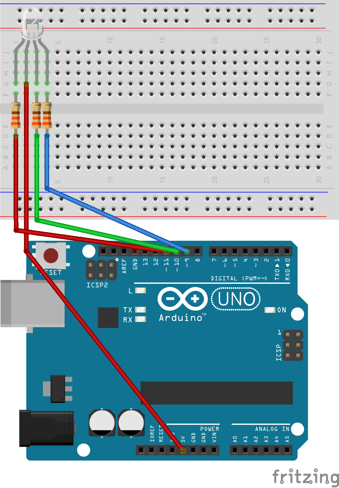
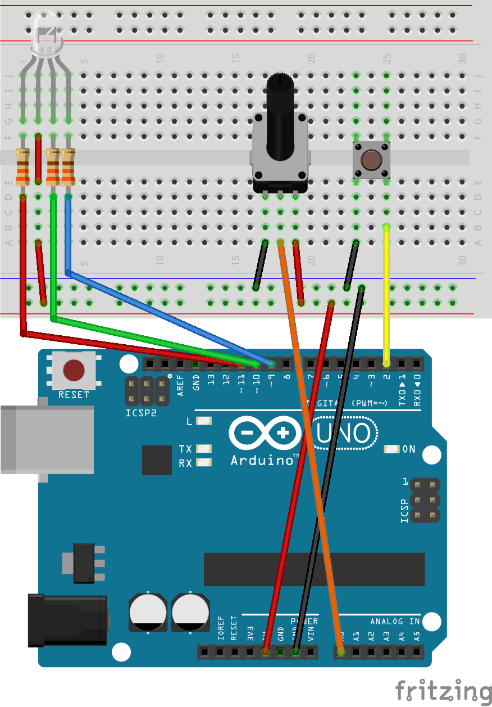

# hsvLED
Tune RGB LED based on HSV model

 The code of this project based on [Adafruit Arduino - Lesson 3. RGB LED](https://learn.adafruit.com/adafruit-arduino-lesson-3-rgb-leds/overview).

### hsvLED
*hsvLED.ino* is a basic arduino sketch to tune a RGB led based on HSV color model.This sketch changes hue of led gradually. A following picture shows a circuit for the sketch.

### hsvLEDsw
You can tune hue and saturation of the led with *hsvLEDsw.ino*.
A following picture shows a circuit for the sketch.
The potentiometer changes saturation and the switch change light color.
 

### Licence
MIT License
